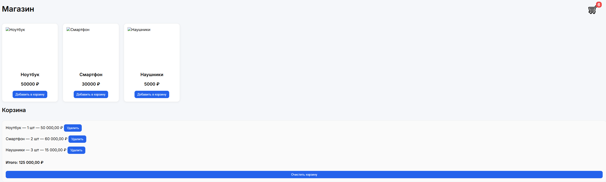

# Fullstack Интернет-магазин

Учебный fullstack проект интернет-магазина с авторизацией пользователей, REST API и хранением данных в PostgreSQL.

Проект демонстрирует базовую архитектуру backend приложения на Node.js и работу frontend с API.

## 🚀 Технологии
Frontend

HTML

CSS

JavaScript (ES6)

Fetch API

LocalStorage (JWT токен)

Backend

Node.js

Express

JWT авторизация

Middleware

Database

PostgreSQL

SQL (SELECT, INSERT, UPDATE, DELETE, JOIN)

## ⚙️ Функциональность
Пользователь

регистрация

авторизация

JWT аутентификация

получение данных пользователя

Товары

получение списка товаров

просмотр информации о товаре

Корзина

добавление товара

увеличение количества

удаление товара

очистка корзины

хранение корзины в PostgreSQL

## 🏗 Архитектура проекта

Backend разделён на слои:

controllers/
routes/
middleware/
db.js
server.js

## Архитектура приложения:

Frontend → REST API (Express) → PostgreSQL
## 🔑 API
Авторизация

Регистрация

POST /api/auth/register

Вход

POST /api/auth/login

Получение профиля пользователя

GET /api/profile
Товары

Получить список товаров

GET /api/products

Получить товар

GET /api/products/:id
Корзина (требуется авторизация)

Получить корзину

GET /api/cart

Добавить товар

POST /api/cart

Удалить товар

DELETE /api/cart/:product_id

Очистить корзину

DELETE /api/cart
## ▶️ Запуск проекта

Установить зависимости

npm install

Запуск сервера

npm run dev

или

npm start
База данных

## PostgreSQL используется для хранения:

пользователей

товаров

корзины пользователей

Основные таблицы:

users
products
cart

## 📸 Скриншоты

